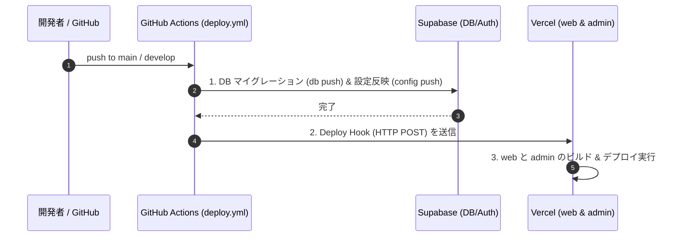

# Vercel デプロイ & セットアップガイド

みらい議会プロジェクトにおける **Vercel** へのデプロイ手順、プロジェクト設定、環境変数、および Deploy Hook の連携手順をまとめたガイドです。

---

## 1. 概要とアーキテクチャ

本リポジトリは `web`（公開用アプリ）と `admin`（管理画面アプリ）の 2 つの Next.js アプリを含むモノリポ構造になっています。

```
mirai-gikai/
├── web/     # 公開用 Next.js アプリ (ポート 3000)
├── admin/   # 管理用 Next.js アプリ (ポート 3001)
└── packages/
```

そのため、Vercel 上では **`web` 用と `admin` 用の 2 つの Vercel プロジェクト** を個別に作成・設定します。

### 自動デプロイの流れ

GitHub Actions の `deploy.yml` を起点として、DBマイグレーション適用後に安全に Vercel デプロイが呼び出される構成になっています。



---

## 2. Vercel プロジェクトの新規セットアップ手順

新規で本番環境（Production）または検証環境（Staging）を構築する手順です。

### 2.1. Web アプリプロジェクトの作成 (`mirai-gikai-web`)

1. [Vercel Dashboard](https://vercel.com/) にアクセスし、**Add New... > Project** を選択。
2. 対象の GitHub リポジトリ (`mirai-gikai`) をインポート。
3. **Configure Project** で以下を設定:
   - **Project Name**: `mirai-gikai-web`（任意）
   - **Framework Preset**: `Next.js`
   - **Root Directory**: **`web`** （※`Edit` をクリックして `web` ディレクトリを指定）
   - **Build Command**: `pnpm build` (デフォルトのままで可)
   - **Install Command**: `pnpm install` (デフォルトのままで可)

### 2.2. Admin アプリプロジェクトの作成 (`mirai-gikai-admin`)

1. 同様に **Add New... > Project** からリポジトリ (`mirai-gikai`) を再度インポート。
2. **Configure Project** で以下を設定:
   - **Project Name**: `mirai-gikai-admin`（任意）
   - **Framework Preset**: `Next.js`
   - **Root Directory**: **`admin`** （※`Edit` をクリックして `admin` ディレクトリを指定）

---

## 3. 環境変数 (Environment Variables) 設定

各 Vercel プロジェクトの **Settings > Environment Variables** にて、対象環境（Production / Preview / Development）ごとに必要な環境変数を追加します。

### 3.1. Web アプリ (`web`) 用の環境変数

| 変数名 | 説明 | 例 / 設定値 |
|---|---|---|
| `NEXT_PUBLIC_SUPABASE_URL` | Supabase の Project URL | `https://<ref>.supabase.co` |
| `NEXT_PUBLIC_SUPABASE_PUBLISHABLE_KEY` | Supabase Publishable (Anon) Key | `sbp_...` または `eyJ...` |
| `SUPABASE_SECRET_KEY` | Supabase Service Role (Secret) Key | `sbp_...` または `eyJ...` |
| `SUPABASE_URL` | APIサーバー用 Supabase URL | `https://<ref>.supabase.co` |
| `ADMIN_URL` | Admin アプリのルート URL | `https://admin.example.com` |
| `AI_GATEWAY_API_KEY` | Vercel AI Gateway API キー | `vck_...` |
| `REVALIDATE_SECRET` | Web側オンデマンド再検証用シークレット | ランダムな長い文字列 |
| `LANGFUSE_PUBLIC_KEY` | (オプション) Langfuse パブリックキー | `pk-lf-...` |
| `LANGFUSE_SECRET_KEY` | (オプション) Langfuse シークレットキー | `sk-lf-...` |
| `LANGFUSE_BASE_URL` | (オプション) Langfuse エンドポイント | `https://cloud.langfuse.com` |

### 3.2. Admin アプリ (`admin`) 用の環境変数

| 変数名 | 説明 | 例 / 設定値 |
|---|---|---|
| `NEXT_PUBLIC_SUPABASE_URL` | Supabase の Project URL | `https://<ref>.supabase.co` |
| `NEXT_PUBLIC_SUPABASE_PUBLISHABLE_KEY` | Supabase Publishable (Anon) Key | `sbp_...` |
| `SUPABASE_SECRET_KEY` | Supabase Service Role (Secret) Key | `sbp_...` |
| `SUPABASE_URL` | APIサーバー用 Supabase URL | `https://<ref>.supabase.co` |
| `NEXT_PUBLIC_WEB_URL` | Web アプリのルート URL | `https://mirai-gikai.org` |
| `ADMIN_MCP_TOKEN` | MCP サーバー接続用 Bearer トークン | ランダムな長い文字列 |

---

## 4. Deploy Hook の作成と GitHub Actions 連携

`deploy.yml` から DB マイグレーション完了後に Vercel デプロイを呼び出すため、Deploy Hook を作成して URL を取得します。

### 4.1. Vercel で Deploy Hook URL を発行する

#### Web プロジェクト (`mirai-gikai-web`):
1. Vercel Dashboard で `mirai-gikai-web` プロジェクトを開く。
2. **Settings > Git** に移動。
3. **Deploy Hooks** セクションで **Create Hook** をクリック。
4. 設定:
   - **Hook Name**: `GitHub Actions Deploy`
   - **Branch**: `main` (Production 用) または `develop` (Staging 用)
5. 生成された URL をコピー。

#### Admin プロジェクト (`mirai-gikai-admin`):
1. 同様に `mirai-gikai-admin` プロジェクトの **Settings > Git > Deploy Hooks** を開く。
2. **Create Hook** をクリックし、`main` または `develop` ブランチ対象の Hook URL を発行してコピー。

### 4.2. GitHub Secrets への登録

発行した Deploy Hook URL を GitHub リポジトリの **Settings > Environments** (`production` または `staging`) に登録します。

- `WEB_VERCEL_DEPLOY_HOOK_URL` ＝ Web アプリの Hook URL
- `ADMIN_VERCEL_DEPLOY_HOOK_URL` ＝ Admin アプリの Hook URL

---

## 5. モノリポでのビルド最適化（任意・推奨）

GitHub Actions の `deploy.yml` 経由のみでデプロイを制御したい場合（通常の Git Push による直接 Vercel 自動デプロイをスキップしたい場合）は、**Ignored Build Step** を設定します。

1. Vercel の **Settings > Git > Ignored Build Step** を開く。
2. **Command** に `exit 0` を設定（または特定のスクリプトを設定）。
3. これにより、GitHub への Git push 時の自動デプロイを抑制し、`deploy.yml` の `curl` (Deploy Hook) 経由でのみデプロイが走るようになります。

---

## 6. 動作確認とトラブルシューティング

### 動作確認手順
1. `develop` または `main` ブランチにコードを Push。
2. GitHub Actions の **Actions > Migrate DB then Deploy** ワークフローが成功することを確認。
3. Vercel Dashboard の **Deployments** タブを開き、Deploy Hook 由来のデプロイが開始され、Green (Ready) になることを確認。

### よくある問題と解決策

#### Q1. `Module not found` や依存関係のエラーでビルドが落ちる
- **原因**: Root Directory の設定漏れ。
- **対応**: Vercel の Settings > General で `Root Directory` が `web` または `admin` に正しく設定されているか確認してください。

#### Q2. 画面を開くと Supabase 接続エラー（401 / Invalid API Key）になる
- **原因**: Vercel 上の `NEXT_PUBLIC_SUPABASE_URL` や `NEXT_PUBLIC_SUPABASE_PUBLISHABLE_KEY` の設定ミス。
- **対応**: Vercel の Settings > Environment Variables で環境変数の値と適用環境（Production/Preview）が合っているか確認し、Redeploy してください。
